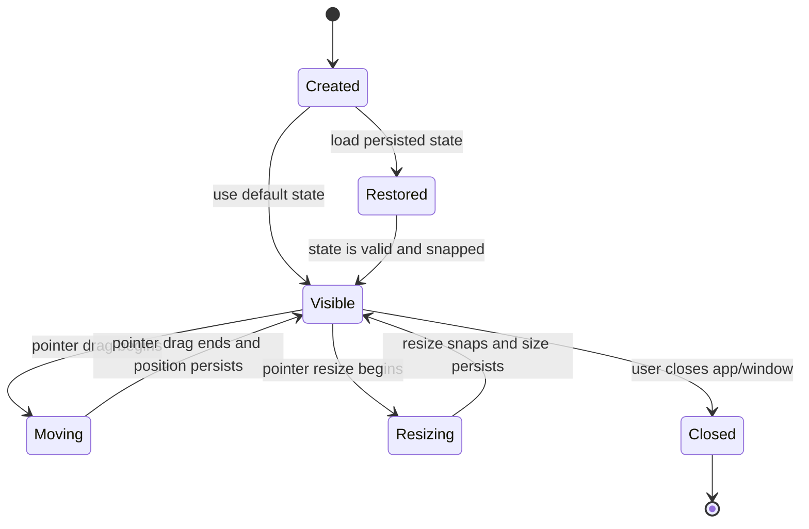
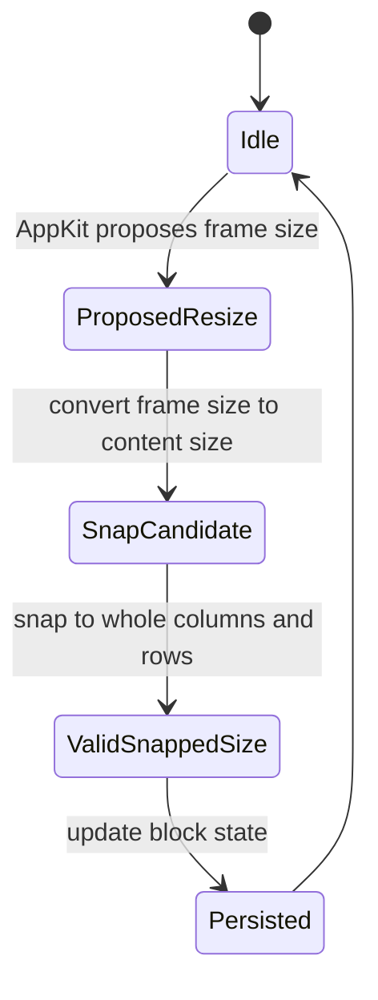
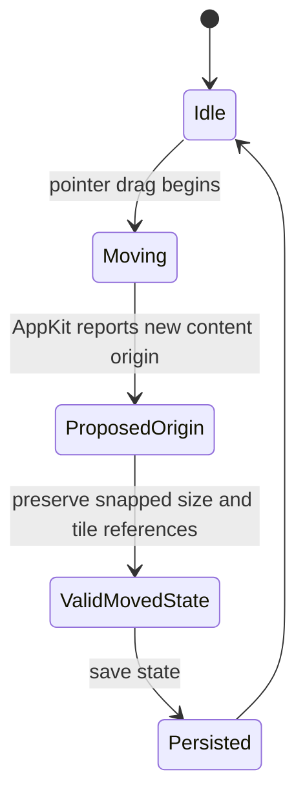
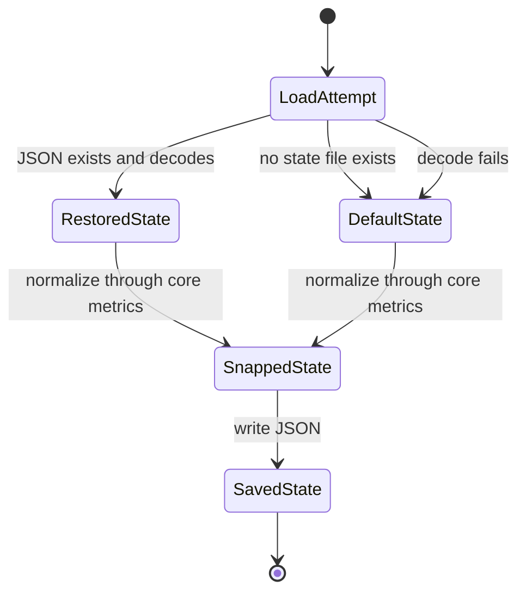
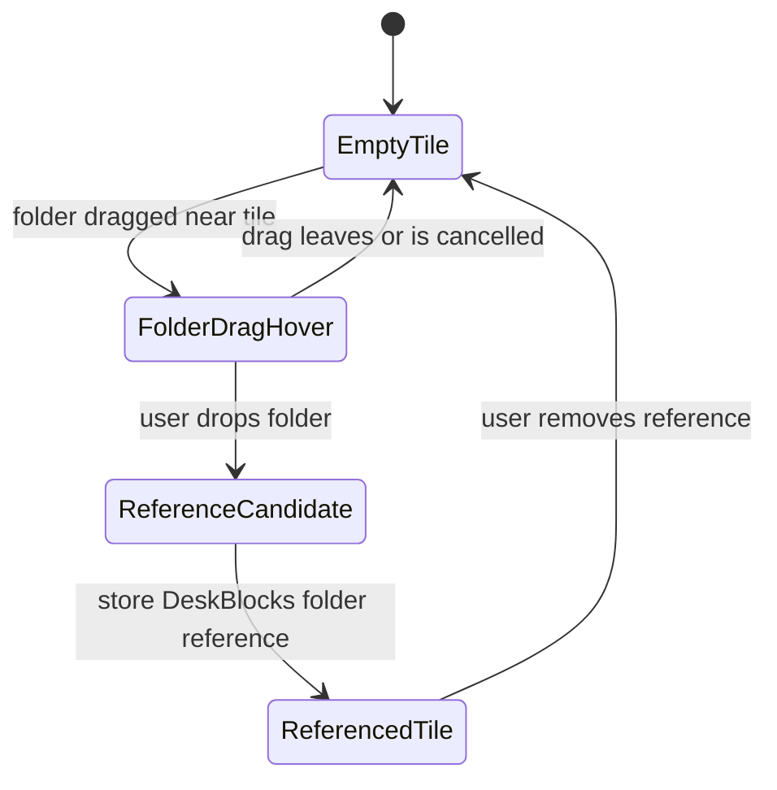

# DeskBlocks State Model

## Purpose

This document captures the deterministic model behind DeskBlocks so implementation work does not drift into implicit behavior or AI-generated slop.

The model is intentionally lightweight. It is not a commitment to a state-machine library. It is the source for deciding what must be true in `DeskBlocksCore` before AppKit or any future UI renders it.

## Architecture Rule

DeskBlocks follows a deterministic-core, UI-shell shape:

- `DeskBlocksCore` owns block geometry, tile counts, snapping, persisted state, and future folder-reference invariants.
- AppKit owns windows, pointer events, rendering, and macOS-specific behavior.
- AppKit may ask the core to produce a valid next state. AppKit must not invent validity rules.
- AI agents may help write code, but workflow decisions and invariants must be expressed in docs, core types, and checks.

## Core Entities

### Block

A block is valid only when:

- It has a title.
- It has a frame with origin and size.
- Its size corresponds to whole tile columns and rows.
- Its column count and row count are at least the configured minimum.
- Its tile references, when present, are UI-owned references, not Finder file ownership.

### Tile Grid

The tile grid is valid only when:

- Tile width and height are constant for the current metrics.
- Resize changes column and row counts, not tile dimensions.
- Final width and height snap to whole tiles plus fixed chrome/padding allowance.
- No half-tile final state exists.

### Tile Reference

A tile reference is valid only when:

- It points to a folder reference stored by DeskBlocks.
- Rendering it does not move, copy, rename, delete, or reorganize the underlying Finder folder.
- Moving the containing block moves the rendered tile item visually with the block.

## Block Lifecycle

## Resize Lifecycle

Resize invariants:

- The persisted size must always be the snapped size.
- The rendered tile size must remain equal to the configured tile metrics.
- Minimum size must include at least one usable tile plus title/frame allowance.

## Move Lifecycle

Move invariants:

- Moving a block changes the block origin only.
- Moving a block must preserve snapped size, columns, rows, and tile references.
- Moving a block must never move the underlying Finder folders referenced by tiles.

## Persistence Lifecycle

Persistence invariants:

- Loaded state must be normalized through the core snapping model before rendering.
- Decode failure must not delete user files or Finder folders.
- Future tile references must survive snapping, moving, resizing, and JSON round-trips.

## Future Folder Reference Lifecycle

Folder-reference invariants:

- Dropping a folder creates or updates a DeskBlocks reference only.
- Dropping a folder must not move the real folder.
- Dropping a top-level Desktop folder follows the same reference-only rule.
- Removing a tile reference must not delete or move the real folder.

## Impossible States

Implementation should make these states impossible or reject/normalize them immediately:

- A block with width or height that resolves to a half tile.
- A block with zero columns or zero rows.
- A rendered tile whose dimensions differ from the configured tile metrics.
- A persisted block state that bypasses snapping before rendering.
- A block move that changes tile references.
- A resize that changes tile dimensions instead of column/row counts.
- A folder reference that implies DeskBlocks owns the real Finder folder.
- A block movement that moves real Finder icons or underlying folders.
- A magnetic placement interaction that manipulates Finder desktop icon positions.

## Current Prototype Mapping

Current code already covers:

- `BlockPoint`, `BlockSize`, `BlockFrame`.
- `TileGridMetrics`.
- `DeskBlockState`.
- `TileReference` placeholder model.
- Core snapping through `TileGridMetrics.snappedSize`.
- State normalization through `DeskBlockState.snapped`.
- JSON round-trip checks through `DeskBlocksCoreChecks`.

Current code still needs manual evidence for:

- Whether the overlay candidate is usable around Finder icons.
- Mission Control behavior.
- Spaces behavior.
- Full-screen app behavior.
- Multi-monitor behavior.

## When To Update This Model

Update this document before implementing:

- multiple blocks
- block creation/removal
- title editing
- folder drag-and-drop
- magnetic tile placement
- any persistence format change
- any new AppKit behavior that changes block lifecycle or visibility

