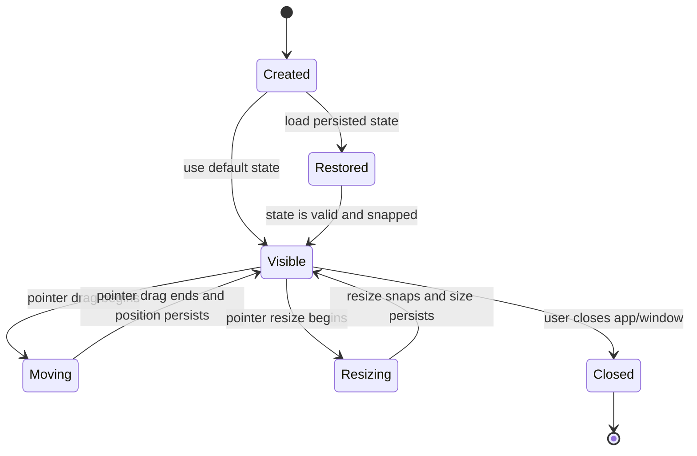
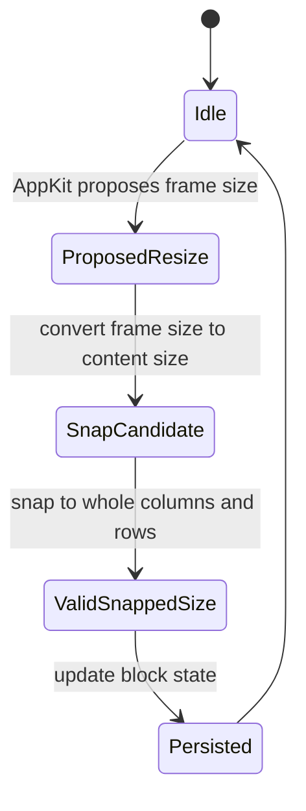
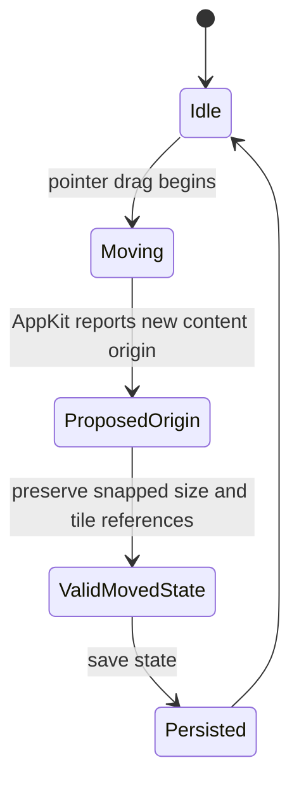
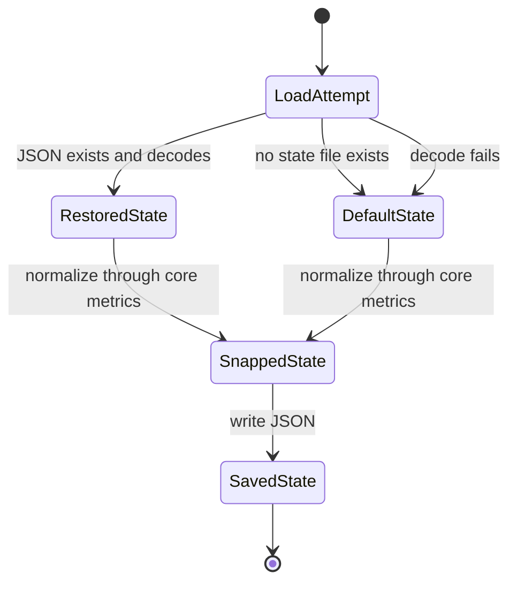
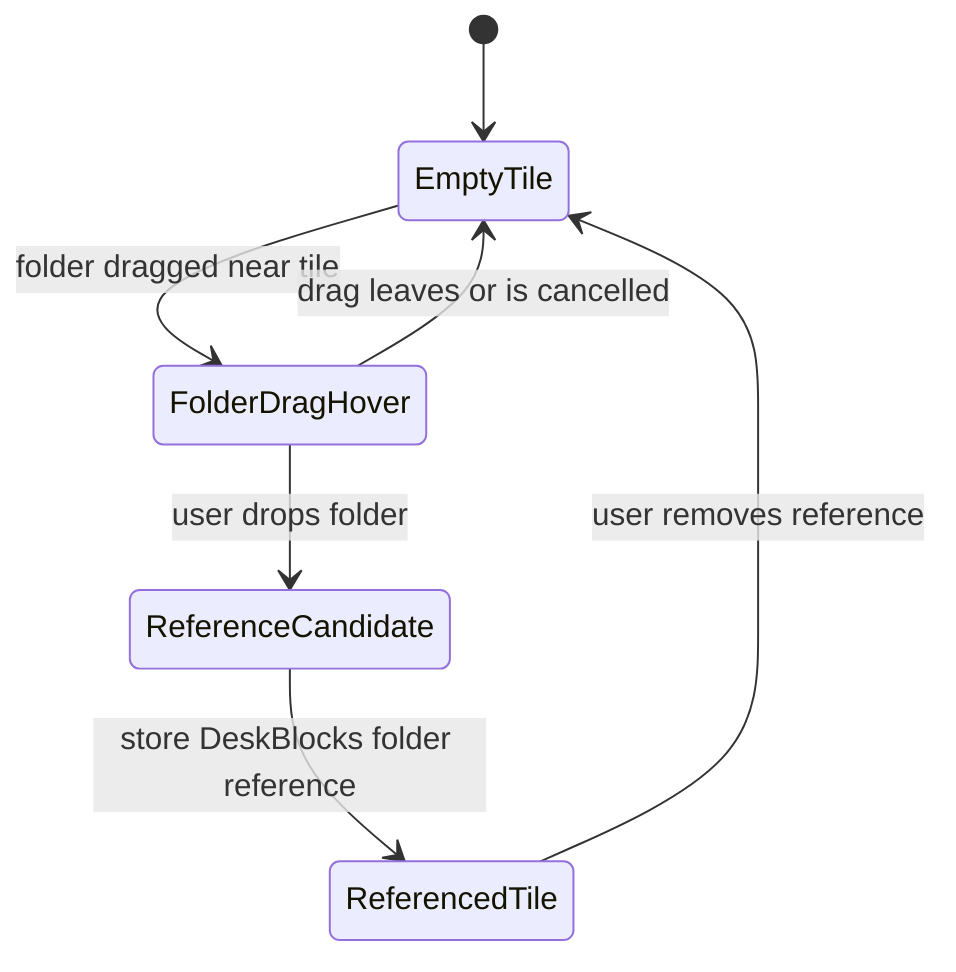

# DeskBlocks State Model

## Purpose

This document captures the deterministic model behind DeskBlocks so implementation work does not drift into implicit behavior or AI-generated slop.

The model is intentionally lightweight. It is not a commitment to a state-machine library. It is the source for deciding what must be true in `DeskBlocksCore` before AppKit or any future UI renders it.

## Architecture Rule

DeskBlocks follows a deterministic-core, UI-shell shape:

- `DeskBlocksCore` owns block geometry, tile counts, snapping, persisted state, and future folder-reference invariants.
- AppKit owns windows, pointer events, rendering, and macOS-specific behavior.
- AppKit may ask the core to produce a valid next state. AppKit must not invent validity rules.
- AI agents may help write code, but workflow decisions and invariants must be expressed in docs, core types, and checks.

## Core Entities

### Block

A block is valid only when:

- It has a title.
- It has a title color.
- It has a frame with origin and size.
- Its size corresponds to whole tile columns and rows.
- Its column count and row count are at least the configured minimum.
- Its tile references, when present, are UI-owned references, not Finder file ownership.

### Tile Grid

The tile grid is valid only when:

- Tile width and height are constant for the current metrics.
- Resize changes column and row counts, not tile dimensions.
- Final width and height snap to whole tiles plus fixed chrome/padding allowance.
- No half-tile final state exists.
- Requested tile count is separate from frame capacity. A non-square request such as `10` can use a `4x3` snapped frame while only `10` tile slots are rendered; unused capacity remains blank.

### Tile Reference

A tile reference is valid only when:

- It points to a bookmark-backed folder reference stored by DeskBlocks.
- It has a tile index inside the block's current requested tile count.
- At most one tile reference occupies a given tile index.
- Rendering it does not move, copy, rename, delete, or reorganize the underlying Finder folder.
- Moving the containing block moves the rendered tile item visually with the block.

## Block Lifecycle

## Resize Lifecycle

Resize invariants:

- The persisted size must always be the snapped size.
- The rendered tile size must remain equal to the configured tile metrics.
- Minimum size must include at least one usable tile plus title/frame allowance.
- Minimum rows for a requested tile count are derived from the current snapped column count, not from the original near-square creation layout.
- Maximum resize size is capped by the visible screen bounds available from the block's current window position.
- The visible viewport is capped at 10 full tile rows and 10 full tile columns.
- If requested tiles exceed viewport capacity, hidden tiles remain reachable through transient scroll state rather than making the block grow offscreen.

## Move Lifecycle

Move invariants:

- Moving a block changes the block origin only.
- Moving a block must preserve snapped size, columns, rows, and tile references.
- Moving a block must never move the underlying Finder folders referenced by tiles.

## Persistence Lifecycle

Persistence invariants:

- Loaded state must be normalized through the core snapping model before rendering.
- Decode failure must not delete user files or Finder folders.
- Future tile references must survive snapping, moving, resizing, and JSON round-trips.
- Missing legacy title color data must decode to the default pure white title color.

## Future Folder Reference Lifecycle

Folder-reference invariants:

- Dropping a folder creates or updates a DeskBlocks reference only.
- The durable reference is bookmark data; the last known path is fallback/debug metadata only.
- Dropping onto a tile stores the target tile index.
- Magnetic hover state is transient UI state and must not be persisted.
- Dropping a folder must not move the real folder.
- Dropping a top-level Desktop folder follows the same reference-only rule.
- Removing a tile reference must not delete or move the real folder.
- Opening a tile reference resolves the bookmark first and may fall back to the last known path when available.

## Impossible States

Implementation should make these states impossible or reject/normalize them immediately:

- A block with width or height that resolves to a half tile.
- A block with zero columns or zero rows.
- A rendered tile whose dimensions differ from the configured tile metrics.
- A persisted block state that bypasses snapping before rendering.
- A block move that changes tile references.
- A resize that changes tile dimensions instead of column/row counts.
- A folder reference that implies DeskBlocks owns the real Finder folder.
- Two folder references occupying the same tile index in the same block.
- A folder reference whose tile index is outside the block's requested tile count.
- A block movement that moves real Finder icons or underlying folders.
- A magnetic placement interaction that manipulates Finder desktop icon positions.

## Current Prototype Mapping

Current code already covers:

- `DeskBlockID` for stable block identity.
- `BlockPoint`, `BlockSize`, `BlockFrame`.
- `TileGridMetrics`.
- `DeskBlockState`.
- `DeskBlocksState` for multiple blocks.
- `TileReference` with explicit tile index and bookmark-backed folder reference.
- Core snapping through `TileGridMetrics.snappedSize`.
- State normalization through `DeskBlockState.snapped`.
- Multiple-block normalization through `DeskBlocksState.snapped`.
- JSON round-trip checks through `DeskBlocksCoreChecks`.
- Legacy single-block JSON without a block ID decodes with the prototype block ID.
- Legacy placeholder string folder references decode as bookmark references for compatibility.
- Prototype persistence can save and restore `DeskBlocksState`.
- Prototype rendering can show multiple persisted blocks as separate AppKit windows.
- `File > New Block...` is wired to create a snapped block with a unique ID, user-provided title, and a near-square grid derived from total tile count.
- Close behavior is guarded by `swift run DeskBlocksPrototype --close-smoke`.
- Title editing preserves block identity, geometry, tile references, and persisted state.
- Title color editing preserves block identity, geometry, tile references, and persisted state.
- Rename behavior is guarded by `swift run DeskBlocksPrototype --rename-smoke "Title"`.
- Title color persistence is guarded by `swift run DeskBlocksPrototype --title-color-smoke "1,0.5,0,1"`.
- Block removal preserves non-removed blocks, allows an intentionally empty state, and never affects Finder files.
- Remove behavior is guarded by `swift run DeskBlocksPrototype --remove-smoke`.
- Add/delete tile behavior keeps enough frame capacity for visible tiles and never deletes the last tile.
- Folder references can be placed from a tile context menu through a native folder picker.
- Finder folder drops onto visible tiles use the same bookmark-backed placement path as the folder picker.
- Folder reference bookmark creation is guarded by `swift run DeskBlocksPrototype --add-folder-smoke "/path/to/folder" --tile-index 0`.
- Referenced folders can be opened from a tile context menu or by double-clicking a referenced tile.
- Folder references can be removed from a tile context menu without removing the tile or changing Finder files.
- Folder reference removal is guarded by `swift run DeskBlocksPrototype --remove-folder-smoke --tile-index 0`.

Current feasibility evidence covers:

- Basic desktop and Finder-icon interaction.
- Mission Control behavior, with the known limitation that DeskBlocks stays on the desktop instead of entering Mission Control as a normal managed window.
- Spaces behavior.
- Full-screen app behavior.

Current code still needs future evidence for:

- Multi-monitor behavior when a second display is available.
- Longer daily-use validation of the current `desktopIconWindow + 1` window level.
- Installed `.app` relaunch behavior; the current prototype is relaunched through SwiftPM.

## When To Update This Model

Update this document before implementing or changing:

- block lifecycle behavior
- block creation, removal, title editing, or tile-count behavior
- folder drag-and-drop
- magnetic tile placement
- any persistence format change
- any new AppKit behavior that changes block lifecycle or visibility
